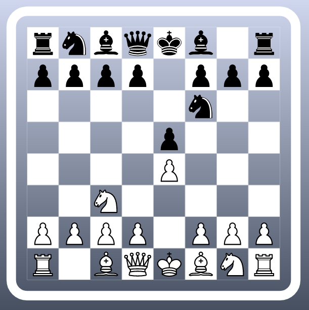

# chess



A simple pass and play chess game.

The chess engine is implemented in TypeScript using a naive offset mailbox pattern, using purely functional
programming techniques.

The curious reader can discover other (more optimal) solutions to the problem at https://www.chessprogramming.org/Main_Page


## Build Setup

```bash
# install dependencies
$ npm install

# serve with hot reload at localhost:3000
$ npm run dev

# build for production and launch server
$ npm run build
$ npm run start

# generate static project
$ npm run generate
```

For detailed explanation on how things work, check out [Nuxt.js docs](https://nuxtjs.org).
